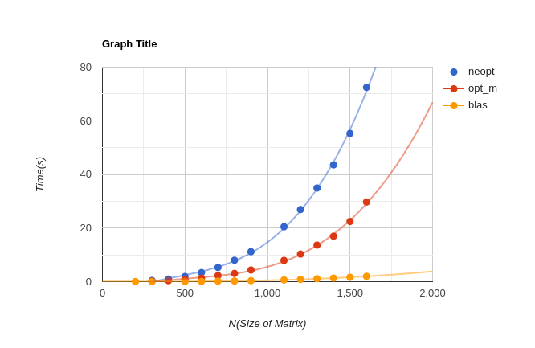

# Tema 2 - Matrix Multiplication

## Requirement

Sa se efectueze urmatoarea operatie cu matrice: `C = A * B * B' + A' * A`  
- A si B matrice patratice de double de dimensiune N * N
- A este superior triunghiulara

## Blas implementation

Pentru implementarea cu [BLAS](http://www.netlib.org/blas/) am folosit functiile `cblas_dtrmm`(double triunghiular matrix multiplication) si `cblas_dgemm`.

Am efectuat operatiile in ordinea in care ele apar: 
- AB = A * B, folosind proprietatea ca A este superior triunghiulara
- ABBt = AB * B', folosind inmultirea obisnuita(AB nu este superior triunghiulara)
- AtA = A' * A, folosind proprietatea ca A este superior triunghiulara
- la sfarsit, am adunat cele 2 matrice in matricea C

## NEOPT implementation

- implementarea neoptimala a operatiilor
- pentru realizarea ei, am inmultit matricele cu cele 3 for-uri clasice.
- la inmultirile cu matricea A (A * B si A' * A) am tinut cont de faptul ca A este `superior triunghiulara`, schimband range-ul pentru indexul liniilor/coloanelor ce se acceseaza din matricea A

## OTP implementation

- implementarea optimizata manual
- pentru a micsora timpul de rulare, am optimizat timpul de acces la memorie:
    - toate variabilele folosite(indecsii si variabile sum) sunt declarate ce keyword-ul `register`
    - pentru a face mai putine accese la memoria principala, suma se face in variabila `sum`, declarata ca `register`, accesandu-se o singura data adresa de memorie unde va fi stocat rezultatul

### A * B multiplication
- avand in vedere ca A este superior triunghiulara, nu are sens parcurgerea coloanelor mai jos de diagonala principala(deoarece elementele de sub diagonala principala sunt 0). De aceea, indicele pleaca de la i

### A' * A multiplication
- Se va folosi proprietatea ca matricea A este superior triughiulara
- Transpusa matricei A va fi inferior triunghiulara, iar daca vom analiza inmultirea celor 2 matrice, se poate observa ca fiecare element din rezultat contine in compozitia lui doar elemente ce au linia minimul dintre i si j(deoarecele restul elementelor sunt 0). Practic, cu cat ne apropiem de coltul dreapta jos al matricei, cu atat vom avea mai multe elemente inmultite, doarece aici nu sunt zerouri.

## Cachegrind

- varianta neoptimizata
```
==29711== D   refs:      2,759,590,560  (2,639,432,484 rd   + 120,158,076 wr)
==29711== D1  misses:       52,020,258  (   51,949,081 rd   +      71,177 wr)
==29711== LLd misses:          113,079  (       62,023 rd   +      51,056 wr)
==29711== D1  miss rate:           1.9% (          2.0%     +         0.1%  )
==29711== LLd miss rate:           0.0% (          0.0%     +         0.0%  )
```
- varianta optimizata
```
==29710== D   refs:        813,056,452  (810,391,322 rd   + 2,665,130 wr)
==29710== D1  misses:       52,191,920  ( 51,945,369 rd   +   246,551 wr)
==29710== LLd misses:          113,078  (      2,026 rd   +   111,052 wr)
==29710== D1  miss rate:           6.4% (        6.4%     +       9.3%  )
==29710== LLd miss rate:           0.0% (        0.0%     +       4.2%  )
```

Daca inspectam output-ul cachegrind, se poate observa ca desi varianta optimizata are o rata de miss mai mare(9.3% vs 0.1%), numarul de read-uri este de aproximativ **3 ori mai mic**, iar numarul de write-uri de **45 ori mai mic**.

## Time Comparison



Graficul prezentat este facut pe baza urmatoarelor valori:

| Matrix Size | NEOPT     | OPT       | BLAS     |
|:-----------:|-----------|-----------|----------|
| 300         | 0.463843  | 0.193456  | 0.027869 |
| 400         | 0.990357  | 0.384109  | 0.046227 |
| 500         | 1.943393  | 0.743817  | 0.073024 |
| 600         | 3.401591  | 1.324224  | 0.112802 |
| 700         | 5.308603  | 2.282834  | 0.216528 |
| 800         | 8.003953  | 3.089454  | 0.260059 |
| 900         | 11.181709 | 4.357147  | 0.369597 |
| 1100        | 20.481323 | 7.935046  | 0.663317 |
| 1200        | 26.899799 | 10.296909 | 0.850983 |
| 1300        | 34.921803 | 13.646874 | 1.098453 |
| 1400        | 43.564064 | 16.964916 | 1.342515 |
| 1500        | 55.268566 | 22.453712 | 1.653533 |
| 1600        | 72.434303 | 29.709724 | 2.001687 |

Analizand datele de la cele 3 implementari, se poate observa:
- implementarea cu **blas** este de aproximativ **12 ori** mai rapida decat varianta **opt_m**
- implementarea **optima** neoptima este de aproximativ **2.6 ori** mai rapida decat **opt_m**.

## Bibliography
- BLAS
    - http://www.netlib.org/blas/cblas.h
    - http://www.netlib.org/lapack/explore-html/de/da0/cblas_8h_source.html
    - https://www.gnu.org/software/gsl/doc/html/blas.html#c.gsl_blas_dtrmm